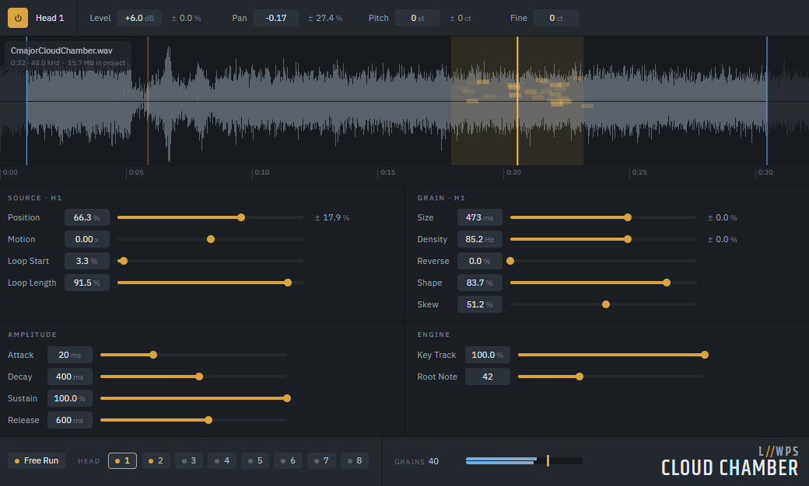

# Cloud Chamber Granular Synth



A granular synthesizer with 8 individual play heads, built as a [cmajor] patch with a [vue.js] UI.

Drop an audio file into the synth and each head can independently scan its own region of the shared
buffer, with its own position, motion, and grain parameters. The heads run simultaneously, creating
layered granular textures from a single source recording.

Use it as a MIDI-playable instrument or let it free-run as an evolving drone. The editor visualizes
the buffer, loop regions, and head positions so you can see how the grains are moving through the
source.

#### 🔊 [Bandcamp] / [Soundcloud] / [Apple Music] / [Spotify]

---

## Installing

Download `CloudChamber-<version>.zip` from the [releases], unzip it, and drag
`CloudChamber.cmajorpatch` into the Cmajor plugin.

## Building

```
pnpm install
pnpm build
```

`dist/` is then the patch bundle — `CloudChamber.cmajorpatch`, `CloudChamber.cmajor` and the
compiled `main.js` view — ready to load in a host.

#### Building a CLAP plugin

The [CLAP] headers are not part of cmajor, so clone them once next to this project:

```
git clone --depth 1 https://github.com/free-audio/clap.git ../clap
```

`pnpm run build-clap` then builds the ui and generates a self-contained CLAP plugin project into
`dist-clap`, with the include path to the CLAP headers already baked into its CMakeLists (the Vue
gui is embedded into the generated C++). Open that folder in your IDE, or build it from the command
line:

```
cmake -S dist-clap -B dist-clap/build
cmake --build dist-clap/build --config Release
```

## License

Cloud Chamber is licensed under the [GNU General Public License v3.0 or later](LICENSE).

The bundled IBM Plex Sans and Khand fonts are licensed under the SIL Open Font License; their
licenses ship alongside them in `public/fonts/`.

[releases]: https://github.com/loowps/cmajor-cloud-chamber/releases
[CLAP]: https://github.com/free-audio/clap
[cmajor]: https://github.com/cmajor-lang/cmajor
[vue.js]: https://vuejs.org/
[Bandcamp]: https://loowps.bandcamp.com
[Soundcloud]: https://soundcloud.com/loowps
[Apple Music]: https://music.apple.com/us/artist/loowps/1326334750
[Spotify]: https://open.spotify.com/artist/2jOQrKX3rRoZORPfFcXaYU
